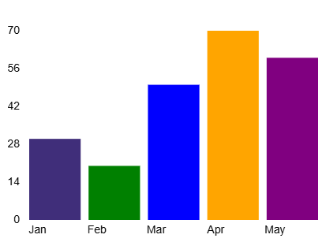
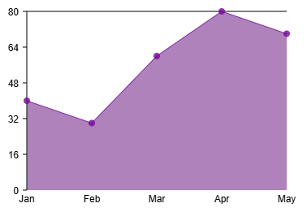
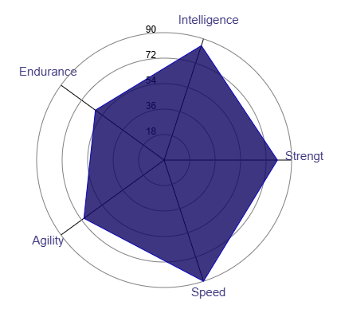
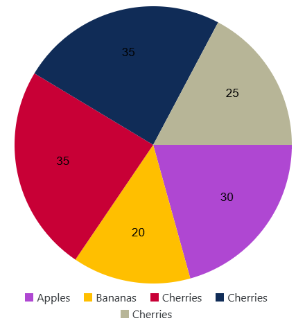
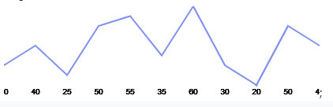

# pmcharts 
pmcharts is a collection of customizable chart components for React using HTML Canvas.

`Area Chart` 
`Bar Chart`
`Line Chart`
`Pie Chart`
`Redar Chart`
`Sparkline Chart`

## Installation

### You can install pmcharts using npm:
```npm install pmcharts --save```

Props:
* data (array): Array of objects with label and value.
* width (number): Width of the chart in pixels.
* height (number): Height of the chart in pixels.
* color (string, optional): Color of the sparkline.

## Components

### BarChart
A customizable bar chart component.




### Example: 
`code`
 
    import React from 'react';
    import { BarChart } from 'pmcharts';

    const MyBarChart = () => {
    const data = [
    { label: 'A', value: 10 },
    { label: 'B', value: 20 },
    { label: 'C', value: 15 },
    // Add more data points as needed
    ];

    return (
    <div style={{ width: '400px', height: '300px' }}>
      <BarChart data={data} width={400} height={300} />
    </div>
    );
    };

    export default MyBarChart;

### AreaChart
A customizable area chart component.



### Example: 
`code` 
    
    import React from 'react';
    import { AreaChart } from 'pmcharts';

    const MyAreaChart = () => {
    const data = [
    { label: 'Jan', value: 50 },
    { label: 'Feb', value: 60 },
    { label: 'Mar', value: 45 },
    // Add more data points as needed
    ];

    return (
    <div style={{ width: '400px', height: '300px' }}>
      <AreaChart data={data} width={400} height={300} />
    </div>
    );
    };

    export default MyAreaChart; 
### RadarChart
A customizable radar chart component.



### Example: 
`code`
  
    import React from 'react';
    import { RadarChart } from 'pmcharts';

    const MyRadarChart = () => {
    const data = [
    { label: 'Category 1', value: 80 },
    { label: 'Category 2', value: 60 },
    { label: 'Category 3', value: 70 },
    // Add more data points as needed
    ];

    return (
    <div style={{ width: '400px', height: '300px' }}>
      <RadarChart data={data} width={400} height={300} />
    </div>
    );
    };

    export default MyRadarChart;
### PieChart
A customizable pie chart component.



### Example: 
`code`
 
    import React from 'react';
    import { PieChart } from 'pmcharts';

    const MyPieChart = () => {
     const data = [
    { label: 'Category A', value: 30, color: 'blue' },
    { label: 'Category B', value: 50, color: 'green' },
    { label: 'Category C', value: 20, color: 'orange' },
    // Add more data points as needed
    ];

    return (
    <div style={{ width: '400px', height: '300px', position: 'relative' }   }>
      <PieChart data={data} width={400} height={300} />
    </div>
     );
    };

    export default MyPieChart;

### SparklineChart
A customizable sparkline chart component.



### Example: 
`code`

    import React from 'react';
    import { SparklineChart } from 'pmcharts';
    const MySparklineChart = () => {
    const data = [10, 20, 15, 30, 25, 35, 20];
    return (
    <div style={{ width: '400px', height: '100px' }}>
       <SparklineChart data={data} width={400} height={100} color="red" />
    </div>
    );
    };

    export default MySparklineChart; 

## License
This project is licensed under the MIT License - see the LICENSE file for details.